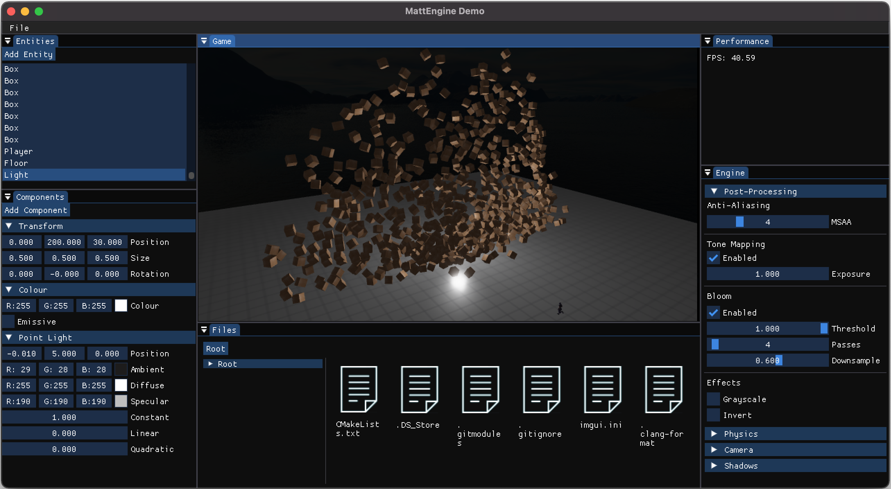

# MattEngine
A 3D game engine written in C++ using OpenGL and ImGui.

## Features
- Code only usage via library plus interactive editor built with ImGui. 
- Basic Phong lightning currently supporting point lights.
- Shadow support via cascaded shadow maps.
- Basic PhysX integration with character controllers and rigid bodies. 
- Post processing options including tone mapping, bloom, and MSAA.

## Setup

CMake build system using Git submodules.

## Usage
- Use generated `mattengine` static library.
- Run `demo` and `demo_physics` binaries from `build/output/bin/[Variant]/`.
    - Append `_editor` to execute demo in editor.

## Screenshots

